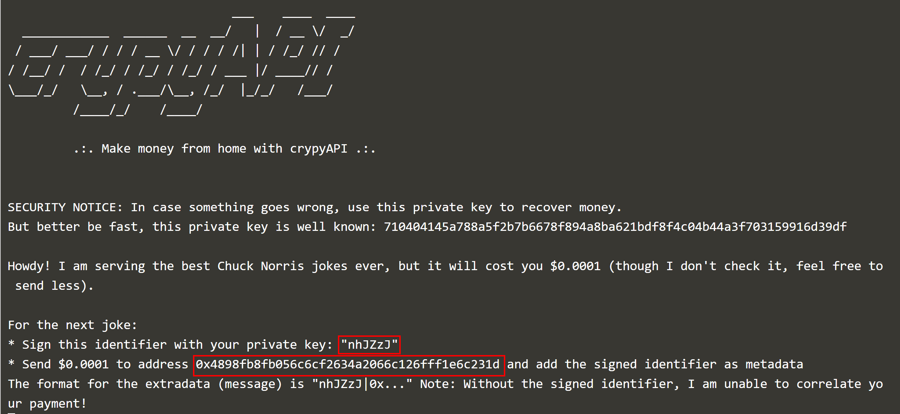
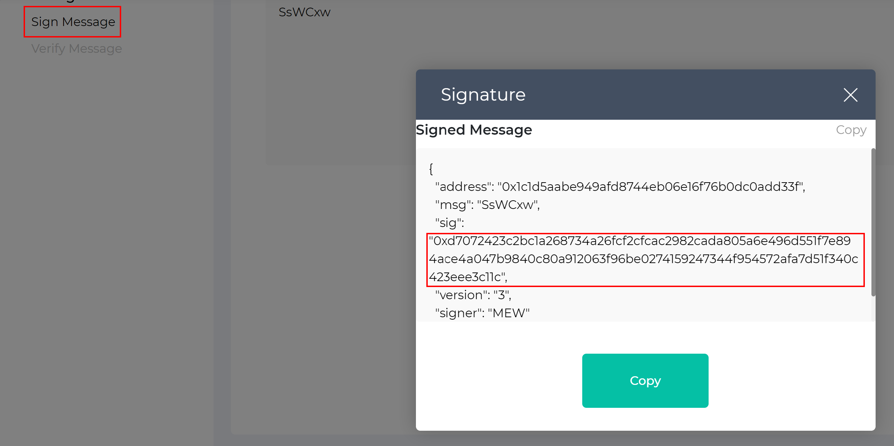
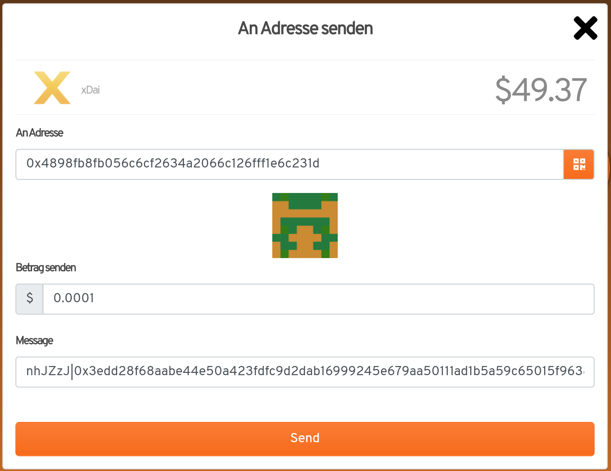
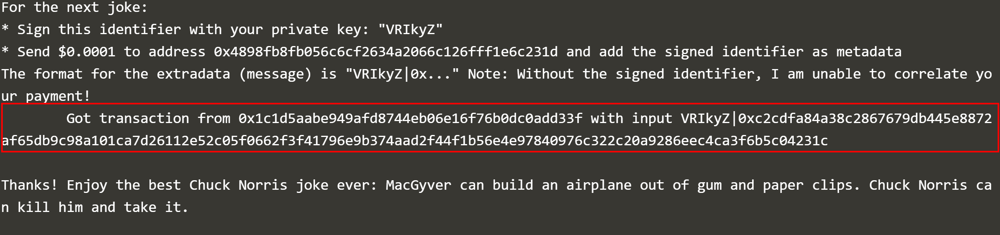
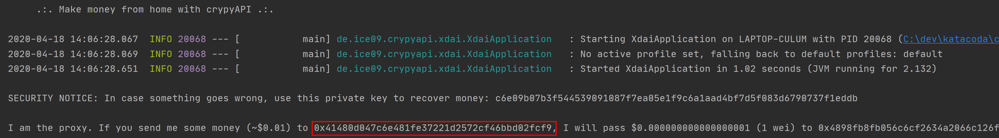
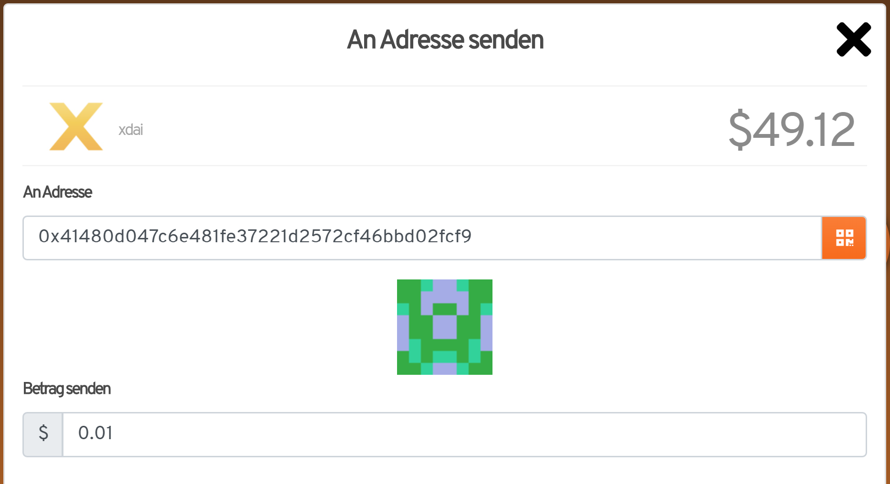
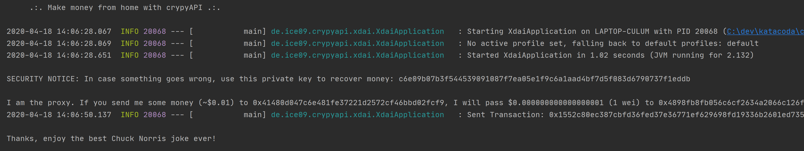

# Chuck Norris Joke Machine

This repository contains two possible implementations of the Joke Machine mentioned in blog post:

The easier version for simple testing is the proxy version.

## Chuck Norris Joke Machine (Manual Version)

* Installed MetaMask (http://metamask.io), configured for xDai network (ID 100) with at least 0.01 XDAI balance

### Start Chuck Norris Joking Machine

* Download latest version of demo.

`curl -s https://api.github.com/repos/ice09/crypyapi-demo/releases/latest | grep "crypyapi-0.0.8.jar" | cut -d : -f 2,3| tr -d \" | wget -qi -`

* Start demo.

`java -jar crypyapi-0.0.8.jar`

* Note down the address and transaction identifier.

* Go to https://www.myetherwallet.com/interface/sign-message

* Send 0.0001 XDAI to the address with the signed transaction identifier in Burnerwallet (https://xdai.io)

* Watch the best Chuck Norris joke ever after the payment could be successfully correlated to the transaction identifier.

That's it, you just paid a machine for a cheap joke, congratulations!

## Chuck Norris Joke Machine Proxy Version

* Installed MetaMask (http://metamask.io), configured for xDai network (ID 100) with at least 0.01 XDAI balance

### Start Chuck Norris Joking Machine

* Download latest version of demo.

`curl -s https://api.github.com/repos/ice09/crypyapi-demo/releases/latest | grep "crypyapi-0.0.8.jar" | cut -d : -f 2,3| tr -d \" | wget -qi -`

* Start Chuck Norris joke server.

`java -jar crypyapi-0.0.8.jar`

* Note down the transaction identifier (6-digit alphanummeric)

* In the other terminal, start Chuck Norris joke proxy, add transaction identifier as command line argument.

`java -jar crypyapi-0.0.8.jar`

* Note down the proxy address.

* Send 0.01 XDAI to the proxy address with the signed transaction identifier in Burnerwallet (https://xdai.io)

* The proxy will receive the transaction, sign the transaction identifier with its private key and send the server the signed transaction identifier as additional transaction data.

* Watch the best Chuck Norris joke ever after the payment could be successfully correlated to the transaction identifier.

That's it, you just paid a machine for a cheap joke, congratulations!